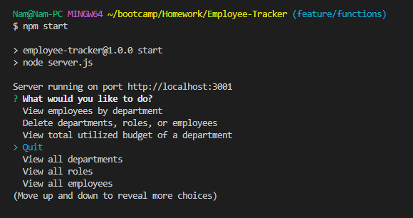
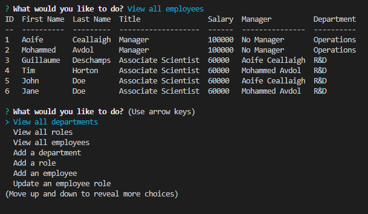

# Employee Tracker

  

  ## Description

  The employee tracker uses a mysql database as a command line application to keep track of employees, their job title, manager, first name, last name, etc. in the database. The command line application can add an employee, add a department, add a role (job title), or update employees. The application can also delete roles/departments/employees from the database. The application is an exercise in using mysql to store data and prepared statements.

  ## Table of Contents

  - [Installation](#installation)
  - [Usage](#usage)
  - [Credits](#credits)
  - [License](#license)
  - [Contribution](#contribution)
  - [Test](#test)

  ## Installation

  To use this program, download the application by first cloning or downloading the repository to your local machine on GitHub:

  [Employee Tracker Link](https://github.com/nambui17/Employee-Tracker)

  Download any dependencies by running the command:
  ```
  npm i
  ```
  Make sure that MySQL is able to be used on your local machine. If it isn't then MySQL databases must be set up before using the Employee Tracker application.
  
  Open a command line terminal and navigate to the Employee-Tracker repository. Log into the MySQL with your credentials. For example, run the following command:
  ```
  mysql -u root -p
  ```
  Then enter your password to log into MySQL. Once you are logged in, run the schema and seeds files in the `db` folder. If the Employee-Tracker folder is opened in the command line, run the following commands:
  ```
  SOURCE db/schema.sql
  ```

  And
  ```
  SOURCE db/seeds.sql
  ```
  This will initialize the database and populate it with initial data. Create a .env file and add your credentials to it: For example:
  ```
  DB_USER = 'root'
  DB_NAME = 'employees_db'
  DB_PASSWORD = "password1234"
  ```
  Make sure that the password is the password to your MySQL user.
  
  ## Usage

  Run the program by using either of the following commands:
  ```
  node server.js
  ```
  or
  ```
  npm start
  ```
  The start prompt should appear

  
  
  Scroll up and down using the arrow keys in the command line. Select the action that you wish to perform and press enter to select.
  Follow the command prompts for actions other than viewing employees, roles, or departments. The options list should appear below any results that may have outputted during the process of the application. An example output of the employees table is shown here.
  
  

  A video tutorial can be viewed here.

  [Video Tutorial](https://watch.screencastify.com/v/g9e8M4jiudl0D5buk7tT)

  ## Credits

  N/A

  ## License 

  This project is covered under the MIT License. View the Repo or navigate to the license link below.

  [MIT License](https://spdx.org/licenses/MIT.html)

  ## Contributing

  N/A

  ## Tests

  N/A

  ## Questions

  Please visit my GitHub profile or reach me at my email for any further questions!

  GitHub Link: [nambui17](https://github.com/nambui17)

  E-mail: nam.bui17@icloud.com

  
  
  